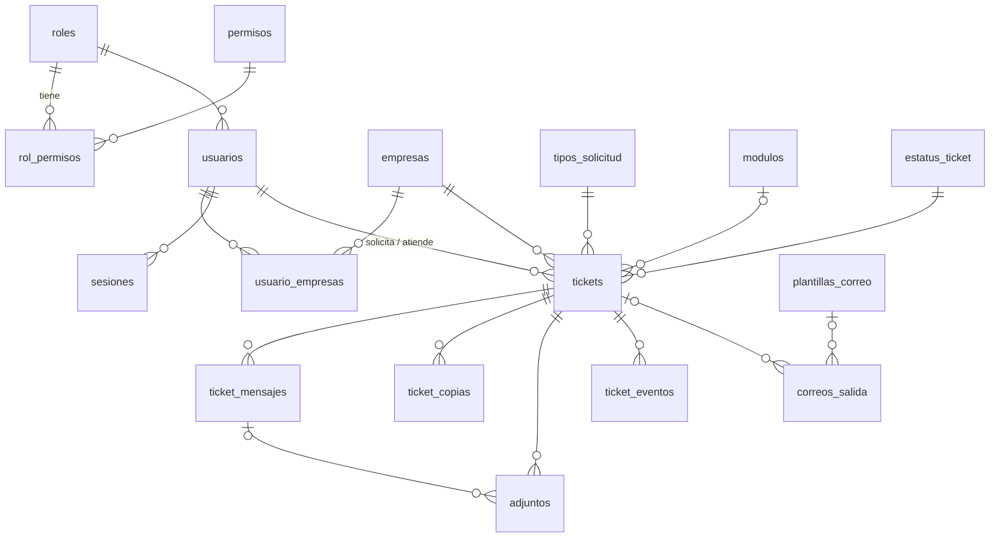

# Modelo de base de datos — propuesta

PostgreSQL 17 · UTF-8 · fechas en UTC con `TIMESTAMPTZ(3)` · banderas `BOOLEAN` (el código las recibe como 0/1) · JSON en `JSONB`.
Usuario, correo y nombres de catálogos usan la intercalación ICU `sin_acentos` (sin distinguir mayúsculas ni acentos, como la `utf8mb4_0900_ai_ci` de la versión con MySQL). Las tablas de abajo conservan los tipos con que se diseñaron en MySQL; la equivalencia exacta está en `apps/api/src/db/migraciones/0001_base.ts`.
Convenciones: nombres en español con `snake_case`, PK `id` de identidad (`GENERATED BY DEFAULT AS IDENTITY`, salvo donde se indica), FK con `ON DELETE RESTRICT` (casi nada se borra físicamente) y `creado_at`/`actualizado_at` en las tablas editables.

## Diagrama

## 1. Acceso y permisos

### `roles`
| Campo | Tipo | Notas |
|---|---|---|
| id | SMALLINT UNSIGNED PK | |
| codigo | VARCHAR(40) UNIQUE | `USUARIO`, `ADMIN_SOPORTE` |
| nombre | VARCHAR(80) | Lo que se ve en pantalla |
| descripcion | VARCHAR(255) NULL | |
| es_sistema | BOOLEAN | Los roles del sistema no se pueden borrar |
| creado_at, actualizado_at | DATETIME(3) | |

### `permisos`
| Campo | Tipo | Notas |
|---|---|---|
| id | SMALLINT UNSIGNED PK | |
| codigo | VARCHAR(60) UNIQUE | por ejemplo `tickets.tomar` |
| grupo | VARCHAR(40) | Para agruparlos en la futura pantalla de permisos |
| descripcion | VARCHAR(255) | |

### `rol_permisos`
PK (`rol_id`, `permiso_id`); FK a las dos tablas.

**Permisos iniciales:**

| Código | Usuario | Admin soporte |
|---|:-:|:-:|
| `tickets.crear` | ✔ | ✔ |
| `tickets.crear_a_nombre_de` | | ✔ (P12) |
| `tickets.ver_propios` | ✔ | ✔ |
| `tickets.ver_empresa` | (P5) | |
| `tickets.ver_todos` | | ✔ |
| `tickets.comentar_propios` | ✔ | ✔ |
| `tickets.tomar` · `.pausar` · `.responder` · `.cerrar` | | ✔ |
| `tickets.reasignar` | | ✔ |
| `tickets.reabrir` | (P4) | (P4) |
| `tickets.ver_historial` | | ✔ |
| `usuarios.administrar` | | ✔ |
| `usuarios.cerrar_sesion` | | ✔ |
| `catalogos.administrar` | | ✔ |
| `correos.plantillas` · `correos.cola` | | ✔ |
| `ajustes.administrar` | | ✔ |

### `usuarios`
| Campo | Tipo | Notas |
|---|---|---|
| id | INT UNSIGNED PK | Se muestra como `#152` |
| username | VARCHAR(60) UNIQUE | Se usa para iniciar sesión; no se reutiliza (D18) |
| nombre | VARCHAR(120) NULL | Nombre para mostrar (P18); si está vacío se usa `username` |
| email | VARCHAR(254) | Índice no único (algunos buzones son compartidos) |
| password_hash | VARCHAR(255) | argon2id |
| rol_id | SMALLINT UNSIGNED FK | |
| activo | BOOLEAN DEFAULT 1 | |
| intentos_fallidos | TINYINT UNSIGNED DEFAULT 0 | |
| bloqueado_hasta | DATETIME(3) NULL | |
| ultimo_login_at | DATETIME(3) NULL | NULL = "Nunca" |
| password_cambiado_at | DATETIME(3) | |
| eliminado_at | DATETIME(3) NULL | Baja lógica |
| origen | ENUM('SISTEMA','IMPORTADO') | Previsto para la importación |
| id_anterior | INT NULL | Id en el sistema viejo |
| creado_at, actualizado_at | DATETIME(3) | |

Índices: `UNIQUE(username)`, `(rol_id, eliminado_at)`, `(email)`, `UNIQUE(origen, id_anterior)`.

### `usuario_empresas`
PK (`usuario_id`, `empresa_id`); índice (`empresa_id`) para saber qué usuarios tiene cada empresa.

### `sesiones`
| Campo | Tipo | Notas |
|---|---|---|
| id | CHAR(64) PK | SHA-256 del token de la cookie (D5) |
| usuario_id | INT UNSIGNED FK | |
| csrf_token | CHAR(64) | |
| creada_at | DATETIME(3) | |
| ultima_actividad_at | DATETIME(3) | Se actualiza como máximo una vez por minuto |
| expira_absoluta_at | DATETIME(3) | Duración máxima de la sesión |
| cerrada_at | DATETIME(3) NULL | |
| motivo_cierre | ENUM('LOGOUT','INACTIVIDAD','EXPIRADA','ADMIN','BAJA','PASSWORD') NULL | |
| cerrada_por_id | INT UNSIGNED NULL | El admin que la cerró |
| ip | VARCHAR(45) | |
| user_agent | VARCHAR(255) | |

Índices: `(usuario_id, cerrada_at, ultima_actividad_at)` para calcular "En línea"; `(cerrada_at, ultima_actividad_at)` para limpiar sesiones viejas.

### `intentos_login`
`id`, `username` VARCHAR(60), `usuario_id` NULL, `ip`, `exito` BOOLEAN, `motivo` VARCHAR(40), `creado_at`.
Índices: `(username, creado_at)`, `(ip, creado_at)`. Se depura automáticamente después de 90 días.

## 2. Catálogos

### `empresas`
| Campo | Tipo | Notas |
|---|---|---|
| id | SMALLINT UNSIGNED PK | |
| nombre | VARCHAR(120) UNIQUE | |
| codigo | VARCHAR(4) UNIQUE | Parte del folio (`AS`); en mayúsculas, validado con `^[A-Z0-9]{2,4}$` |
| empresa_padre_id | SMALLINT UNSIGNED NULL FK | Solo si P2 confirma que hay sucursales |
| activa | BOOLEAN | |
| orden | SMALLINT | |
| creado_at, actualizado_at | | |

### `tipos_solicitud`
| Campo | Tipo | Notas |
|---|---|---|
| id | SMALLINT UNSIGNED PK | |
| nombre | VARCHAR(80) UNIQUE | |
| codigo | VARCHAR(4) UNIQUE | `CO`, `CA`, `CE`… |
| titulo_detalle | VARCHAR(80) | "Detalle de la corrección" |
| requiere_modulo | BOOLEAN | (S7) |
| requiere_concepto | BOOLEAN | |
| requiere_folios | BOOLEAN | |
| activo, orden, creado_at, actualizado_at | | |

### `modulos`
| Campo | Tipo | Notas |
|---|---|---|
| id | SMALLINT UNSIGNED PK | |
| nombre | VARCHAR(80) UNIQUE | |
| codigo | VARCHAR(6) UNIQUE NULL | Para reportes; hoy no forma parte del folio |
| activo, orden, creado_at, actualizado_at | | |

### `estatus_ticket`
| Campo | Tipo | Notas |
|---|---|---|
| codigo | VARCHAR(20) PK | `PENDIENTE`, `EN_PROCESO`, `PAUSADO`, `COMPLETADO` |
| nombre | VARCHAR(40) | "En proceso" |
| clase_color | VARCHAR(10) | `pend`, `proc`, `paus`, `comp` (clases de la maqueta) |
| es_final | BOOLEAN | |
| orden | TINYINT | Orden de las pestañas y de las columnas del Kanban |

## 3. Tickets

### Folio: `[DEPTO]-[CONSECUTIVO]` (migración 0004, octubre de 2026)
Ejemplos: `VEN-0001`, `SIS-0008`. El consecutivo tiene 4 dígitos (crece a 5 después de 9999), es **independiente por departamento y nunca se reinicia**, así un folio jamás se repite; el año se ve en la fecha del ticket.

Antes el folio era `[DEPTO]-[AÑO]-[CONSECUTIVO]` (`SIS-2026-0007`) y se reiniciaba cada 1 de enero. Esos tickets conservan su folio, y la migración 0004 arrancó el contador nuevo de cada departamento en su último número (`SIS-2026-0007` → el siguiente es `SIS-0008`).

### `departamentos`
| Campo | Tipo | Notas |
|---|---|---|
| id | SMALLINT UNSIGNED PK | |
| nombre | VARCHAR(80) UNIQUE | "Sistemas / TI" |
| codigo | VARCHAR(6) UNIQUE | `SIS`, `RH`: 2 a 6 letras o números en mayúsculas; forma el folio |
| activo, orden, creado_at, actualizado_at | | Se administra en Catálogos → Departamentos |

### `folio_contadores`
| Campo | Tipo | Notas |
|---|---|---|
| departamento | VARCHAR(6) | Código del departamento (PK compuesta) |
| anio | SMALLINT UNSIGNED | `0` = contador continuo actual; un año real = contador del formato anterior, solo para reportes (PK compuesta) |
| ultimo_consecutivo | INT UNSIGNED | Último número emitido |
| actualizado_at | DATETIME(3) | |

Dentro de la transacción de creación del ticket:
`INSERT INTO folio_contadores (departamento, anio, ultimo_consecutivo) VALUES (?, ?, LAST_INSERT_ID(1)) ON DUPLICATE KEY UPDATE ultimo_consecutivo = LAST_INSERT_ID(ultimo_consecutivo + 1)` y después `SELECT LAST_INSERT_ID()`.
"Crear el registro si no existe e incrementarlo" ocurre en **una sola sentencia atómica**. La fila queda bloqueada hasta el `COMMIT`: las creaciones simultáneas del mismo departamento se forman en fila, las de otros departamentos no se estorban, y si la transacción falla el número no se pierde. (Hacerlo con `INSERT IGNORE` + `UPDATE` provoca interbloqueos con muchas creaciones simultáneas.) El 1 de enero no pasa nada: el contador sigue. `UNIQUE(folio)` es la red de seguridad.

### `tickets`
| Campo | Tipo | Notas |
|---|---|---|
| id | BIGINT UNSIGNED PK | |
| folio | VARCHAR(20) UNIQUE | `VEN-0001` (los tickets anteriores conservan su folio con año, `SIS-2026-0001`) |
| departamento_id | SMALLINT UNSIGNED FK | Departamento que creó el ticket; forma el folio |
| tipo_id | SMALLINT UNSIGNED FK | |
| empresa_id | SMALLINT UNSIGNED FK | |
| modulo_id | SMALLINT UNSIGNED NULL FK | Puede ser nulo según el tipo |
| concepto | VARCHAR(200) NULL | |
| folios_ref | VARCHAR(500) NULL | El campo "Folio(s)" que escribe el usuario |
| descripcion_html | MEDIUMTEXT | Ya sanitizado |
| descripcion_texto | TEXT | Versión en texto plano, para búsqueda y correos |
| estatus | VARCHAR(20) FK → estatus_ticket | |
| urgencia | ENUM('BAJA','MEDIA','ALTA','CRITICA') DEFAULT 'MEDIA' | Migración 0004. El orden del ENUM permite `ORDER BY urgencia DESC` (crítica primero) |
| solicitante_id | INT UNSIGNED FK | |
| creado_por_id | INT UNSIGNED FK | Igual al solicitante, salvo P12 |
| asignado_a_id | INT UNSIGNED NULL FK | |
| tomado_at | DATETIME(3) NULL | Paso 2 de la barra |
| primera_respuesta_at | DATETIME(3) NULL | Paso 3 (S2) |
| pausado_at | DATETIME(3) NULL | |
| cerrado_at | DATETIME(3) NULL | |
| cerrado_por_id | INT UNSIGNED NULL FK | |
| version | INT UNSIGNED DEFAULT 0 | Bloqueo optimista (D11) |
| origen | ENUM('SISTEMA','IMPORTADO') | |
| id_anterior | BIGINT NULL | |
| creado_at, actualizado_at | DATETIME(3) | |

Índices (pensados para las consultas reales):
- `UNIQUE(folio)`: búsqueda exacta y por prefijo.
- `(estatus, creado_at)`: pestañas y columnas del Kanban.
- `(urgencia, estatus, creado_at)`: filtro por urgencia y tarjetas "sin atender" del dashboard.
- `(solicitante_id, estatus, creado_at)`: Mis tickets.
- `(asignado_a_id, estatus, creado_at)`: filtro por técnico.
- `(empresa_id, creado_at)`, `(tipo_id, creado_at)`, `(modulo_id, creado_at)`: filtros de la bandeja.
- `(creado_at)`: rango de fechas.
- Búsqueda libre: columna calculada `busqueda` (`tsvector` de concepto, folio(s) y descripción, sin acentos) con índice GIN.
- `UNIQUE(origen, id_anterior)`.

### `ticket_copias` ("Enviar copia a")
| Campo | Tipo | Notas |
|---|---|---|
| id | BIGINT PK | |
| ticket_id | FK | |
| usuario_id | INT UNSIGNED NULL FK | Si es un usuario del sistema |
| email | VARCHAR(254) | Siempre se llena (se copia del usuario al crear la copia) |
| nombre | VARCHAR(120) NULL | |
| creado_at | | |

`UNIQUE(ticket_id, email)`; índice `(usuario_id)` por si P3 decide que las copias pueden ver el ticket.

### `ticket_mensajes` (conversación)
| Campo | Tipo | Notas |
|---|---|---|
| id | BIGINT PK | |
| ticket_id | FK | |
| autor_id | INT UNSIGNED FK | |
| tipo | ENUM('COMENTARIO','RESPUESTA','RESOLUCION') | Comentario = del solicitante; Respuesta y Resolución = de soporte. Se puede agregar `NOTA_INTERNA` después. |
| cuerpo_html | MEDIUMTEXT | Ya sanitizado |
| cuerpo_texto | TEXT | |
| creado_at | DATETIME(3) | |

Índice `(ticket_id, creado_at)`.

### `adjuntos`
| Campo | Tipo | Notas |
|---|---|---|
| id | BIGINT PK | |
| uuid | CHAR(36) UNIQUE | Se usa en la URL y en el nombre del archivo en disco |
| ticket_id | FK | |
| mensaje_id | NULL FK | NULL = adjunto de la descripción original |
| subido_por_id | FK | |
| nombre_original | VARCHAR(255) | Limpio de caracteres peligrosos; solo se usa al descargar |
| ruta_relativa | VARCHAR(255) | `2026/09/<uuid>` |
| mime | VARCHAR(100) | Detectado por contenido |
| tamano_bytes | INT UNSIGNED | |
| sha256 | CHAR(64) | Para verificar la integridad al restaurar un respaldo |
| en_linea | BOOLEAN | Imagen insertada dentro del editor |
| creado_at | | |
| eliminado_at | NULL | |

Índices `(ticket_id, mensaje_id)`, `UNIQUE(uuid)`.

### `ticket_eventos` (historial / línea de tiempo)
| Campo | Tipo | Notas |
|---|---|---|
| id | BIGINT PK | |
| ticket_id | FK | |
| actor_id | INT UNSIGNED NULL | NULL = el sistema |
| tipo | VARCHAR(40) | `CREADO`, `TOMADO`, `PAUSADO`, `REANUDADO`, `REASIGNADO`, `RESPONDIDO`, `COMENTADO`, `ADJUNTO_AGREGADO`, `CERRADO`, `REABIERTO`, `CORREO_ENCOLADO`, `CORREO_ENVIADO`, `CORREO_FALLIDO` |
| estatus_antes, estatus_despues | VARCHAR(20) NULL | Para medir tiempos por estatus |
| datos | JSON NULL | Por ejemplo `{ "de": 12, "a": 15, "motivo": "…" }` |
| creado_at | DATETIME(3) | |

Índices `(ticket_id, creado_at)` y `(tipo, creado_at)` (para reportes).

### `notificaciones` (campana, migración 0004)
| Campo | Tipo | Notas |
|---|---|---|
| id | BIGINT UNSIGNED PK | |
| usuario_id | INT UNSIGNED FK (CASCADE) | Destinatario |
| ticket_id | BIGINT UNSIGNED FK (CASCADE) | Adonde lleva el aviso |
| tipo | ENUM('nuevo_ticket','ticket_contestado') | |
| mensaje | VARCHAR(255) | Texto ya armado ("Soporte respondió tu ticket SIS-2026-0004") |
| leida | TINYINT(1) DEFAULT 0 | |
| creado_at | DATETIME(3) | La "fecha_creacion" de la especificación |

Índices: `(usuario_id, leida, creado_at)` para la campana y `(leida, creado_at)` para depurar las leídas de más de 90 días. La migración 0004 también agrega el permiso `panel.ver` (dashboard) al rol de administración.

## 4. Correo

### `plantillas_correo`
| Campo | Tipo | Notas |
|---|---|---|
| id | SMALLINT PK | |
| codigo | VARCHAR(40) UNIQUE | `TICKET_CREADO`, `TICKET_CERRADO`, `TICKET_RESPUESTA`, `TICKET_NUEVO_SOPORTE` (P9) |
| nombre, descripcion | | |
| asunto | VARCHAR(255) | Con variables: `Ticket {{folio}} creado` |
| cuerpo_html | MEDIUMTEXT | Con variables; se sanitiza al guardarse |
| variables | JSON | Lista de variables permitidas, para mostrarlas en el editor y validarlas |
| activa | BOOLEAN | |
| actualizado_por_id, actualizado_at | | |

### `correos_salida` (cola)
| Campo | Tipo | Notas |
|---|---|---|
| id | BIGINT PK | |
| plantilla_codigo | VARCHAR(40) NULL | |
| ticket_id | BIGINT NULL FK | |
| para | JSON | `[{"email":"…","nombre":"…"}]` |
| cc | JSON NULL | |
| asunto | VARCHAR(255) | Ya armado (D15) |
| cuerpo_html, cuerpo_texto | MEDIUMTEXT | |
| estado | ENUM('PENDIENTE','ENVIANDO','ENVIADO','FALLIDO','CANCELADO') | |
| intentos | TINYINT UNSIGNED | |
| max_intentos | TINYINT UNSIGNED | Por defecto 7 |
| proximo_intento_at | DATETIME(3) | |
| bloqueado_hasta | DATETIME(3) NULL | Para no dejar correos "atorados" en ENVIANDO si el proceso se cae |
| ultimo_error | VARCHAR(1000) NULL | Sin datos sensibles |
| transporte | VARCHAR(20) NULL | `graph`, `smtp`, `consola` |
| id_mensaje_proveedor | VARCHAR(255) NULL | |
| creado_at, enviado_at | | |

Índices: `(estado, proximo_intento_at)` para el trabajador; `(ticket_id)`.

## 5. Configuración y auditoría

### `ajustes`
| Campo | Tipo | Notas |
|---|---|---|
| clave | VARCHAR(60) PK | `sesion.inactividad_min`, `sesion.max_horas`, `login.max_intentos`, `login.bloqueo_min`, `adjuntos.max_mb`, `adjuntos.max_por_mensaje`, `adjuntos.tipos`, `correo.respuestas_activas`, `correo.aviso_soporte_activo`, `correo.aviso_soporte_destino`, `kanban.tarjetas_por_columna` |
| valor | JSON | |
| tipo | ENUM('numero','texto','booleano','lista') | Para armar el formulario de ajustes y validarlo |
| descripcion | VARCHAR(255) | |
| actualizado_por_id, actualizado_at | | |

### `auditoria`
`id`, `actor_id` NULL, `entidad` VARCHAR(40) (`usuario`, `empresa`, `plantilla`, `ajuste`…), `entidad_id` VARCHAR(40), `accion` VARCHAR(40), `datos` JSON (antes/después, **sin** contraseñas ni hashes), `ip`, `creado_at`.
Índices `(entidad, entidad_id, creado_at)` y `(actor_id, creado_at)`.

## 6. Datos iniciales (seeds)
- Roles, permisos y la matriz `rol_permisos` de arriba.
- Estatus: los 4, con su color y orden.
- Tipos de solicitud (6), módulos (7, más "Gestión de Manufactura" si se confirma P10) y empresas (17, más las que falten según P2), con los códigos que se confirmen en P1.
- Plantillas `TICKET_CREADO`, `TICKET_CERRADO` y `TICKET_RESPUESTA`.
- Ajustes con los valores de S8 y S9.
- Admin inicial desde `ADMIN_INICIAL_USUARIO`, `ADMIN_INICIAL_EMAIL` y `ADMIN_INICIAL_PASSWORD` (solo si todavía no existe ningún admin).

Los seeds son **idempotentes**: se pueden correr varias veces sin duplicar nada ni pisar los cambios hechos desde la interfaz.

## 7. Volumen esperado
Hoy hay unos 2,600 tickets. Estimando unos 3,000 al año, en 10 años serían unos 30,000 tickets, 150,000 mensajes y 300,000 eventos. Con los índices de arriba, la base resuelve todas las consultas de la bandeja con un rango sobre el índice. En la fase 7 se comprueba con 20,000 tickets sembrados.
